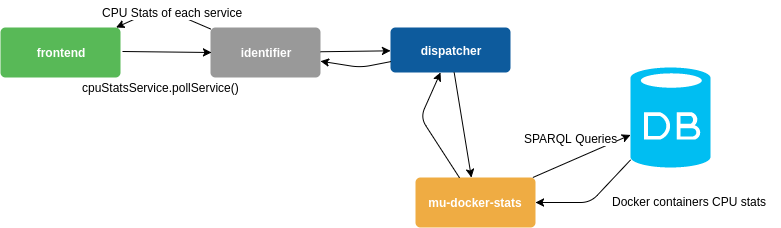

# mu-docker-stats

Microservice to fetch memory & cpu data about the running containers and show them in the frontend for visual feedback. It provides a single entrypoint:

* **/stats**: Fetches the most recent cpu stats measurement of each one of the services provided. Services are identified by their name, constituted like `/<pipeline>_<service>_1` according to the docker compose structure
  * method: GET
  * params: pipelines, services
  * example: **/stats?pipelines=5a0acd2fc74f090009000004,5a0acd2fc74f090009000004&services=webcat,db**

# Workflow Diagram




# Quick Start

Run the file `$ /bin/bash dev.sh <network_prefix>`. The network prefix is to choose a network to attach itself too. Say that you are using the service in the [app-bdi-ide](https://github.com/big-data-europe/app-bdi-ide) project. 

You would need to run `./dev.sh appbdiide` and you are good to go.


# Usage

Add the image to the docker-compose.yml 

```
drc-stats:
    image: bde2020/mu-docker-stats:1.0.1
    depends_on:
      - database
    links:
      - database:database
```


And add links to the dispatcher & delta service to it.
